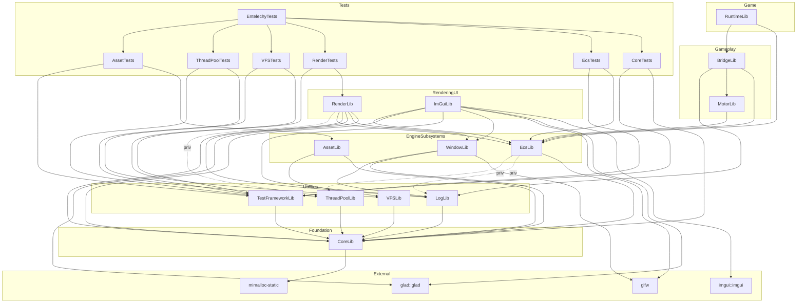

# Entelechy 模块依赖图

> 生成时间：2026-07-07
> 数据来源：根 `CMakeLists.txt`、`cmake/EntelechyModule.cmake`、各模块 `CMakeLists.txt` 与 `launch/cmake_projects.json` / `_game/cmake_projects.json`

---

## 模块依赖图（Mermaid）

---

## 依赖分层（从底向上）

| 层级 | 模块 | 依赖 | 评价 |
|---|---|---|---|
| L0 基础 | `CoreLib` | `mimalloc-static` | ✅ 最小、最底层，无引擎内依赖 |
| L1 工具 | `LogLib` | `CoreLib` | ✅ 正确 |
| L1 工具 | `ThreadPoolLib` | `CoreLib` | ✅ 正确 |
| L1 工具 | `VFSLib` | `CoreLib` | ✅ 正确 |
| L1 工具 | `TestFrameworkLib` | `CoreLib` | ✅ 正确（但不应链接进最终可执行文件） |
| L2 子系统 | `WindowLib` | `glfw`, `CoreLib`, `LogLib` | ✅ 正确 |
| L2 子系统 | `EcsLib` | `CoreLib`（私用 `LogLib`, `ThreadPoolLib`） | ✅ 正确 |
| L2 子系统 | `AssetLib` | `CoreLib`, `VFSLib` | ✅ 正确 |
| L3 游戏逻辑 | `MotorLib` | `EcsLib` | ✅ 正确 |
| L3 游戏逻辑 | `BridgeLib` | `EcsLib`, `MotorLib`, `LogLib` | ⚠️ 名字模糊，职责需明确 |
| L4 渲染/界面 | `RenderLib` | `WindowLib`, `LogLib`, `CoreLib`, `EcsLib`（私用 `ThreadPoolLib`） | ⚠️ 依赖 `EcsLib` 值得商榷 |
| L4 渲染/界面 | `ImGuiLib` | `WindowLib`, `LogLib`, `CoreLib`, `EcsLib` | ⚠️ 依赖 `EcsLib` 值得商榷，且属于工具层 |
| Game | `RuntimeLib` | `EcsLib`, `BridgeLib` | ✅ 正确 |

---

## 发现的问题

### 1. `TestFrameworkLib` 被链接进最终可执行文件

根 `CMakeLists.txt:142-145` 自动链接所有非 `Tests` 结尾的目标。`TestFrameworkLib` 不是 `Tests` 结尾，因此被链接进 `Entelechy`。

**影响**：测试框架代码会进入 shipping 可执行文件，增加体积，且测试宏/注册逻辑污染运行时。

**建议**：
- 修改根 `CMakeLists.txt`，排除 `TestFrameworkLib` 和 `EntelechyTests`；
- 或者给测试相关目标统一加前缀/后缀（如 `TestFrameworkLib` 改名为 `TestFramework`，然后在链接过滤里排除 `Test*`）。

### 2. `RenderLib` 直接依赖 `EcsLib`

`RenderLib` 的 `PUBLIC_DEPS` 里包含 `EcsLib`。

**影响**：渲染层与 ECS 框架强耦合。未来如果做 headless server、命令行工具、或纯渲染测试，都必须带上 ECS。

**建议**：
- 如果 `RenderLib` 内部定义的是“渲染系统/组件”，应把这些代码迁到更高层（例如 `_game` 或独立的 `Renderer` 模块）；
- `RenderLib` 本身应只负责：RHI/图形 API 抽象、渲染命令、GPU 资源、渲染视图等，**不依赖 ECS**；
- ECS 需要渲染时，通过 `RenderLib` 的公共 API 调用，而不是反过来。

### 3. `ImGuiLib` 依赖 `EcsLib`

`ImGuiLib` 的 `PUBLIC_DEPS` 里包含 `EcsLib`。

**影响**：UI 调试层和 ECS 耦合，工具层不应该依赖游戏运行时框架。

**建议**：
- 检查 `ImGuiLib` 是否真的用到 ECS；
- 如果只是编辑器/调试工具需要 ECS 数据，应把这部分代码放到一个独立的 Editor 模块里；
- `ImGuiLib` 应只负责 ImGui 上下文、绘制后端、输入处理。

### 4. `BridgeLib` 职责与位置模糊

`BridgeLib` 依赖 `EcsLib` + `MotorLib` + `LogLib`，名字“Bridge”没有说明它在桥接什么。

**影响**：新成员无法从名字判断该把代码放哪，容易变成“什么都放”的垃圾堆。

**建议**：
- 明确 `BridgeLib` 的职责，例如：
  - 如果是 ECS 与 Motor 之间的胶水层 → 考虑叫 `MotorEcsAdapter` 或并入 `MotorLib`；
  - 如果是引擎子系统与游戏运行时之间的桥接 → 考虑迁到 `_game`；
  - 如果是模块间事件总线 → 改名为 `EventBusLib` 并放在 L2。

### 5. `EcsLib` 的 init function 命名错误

`_engine/source/ecs/CMakeLists.txt:10` 和 `launch/cmake_projects.json:14` 都写的是 `initCore`，但模块是 ECS。

**影响**：符号名误导，且如果 `CoreLib` 未来也注册 `initCore` 会冲突。

**建议**：改名为 `initEcs`。

### 6. 渲染模块未来需要进一步拆分

当前 `RenderLib` 同时承担了：窗口 surface、图形 API、渲染管线、可能还有 ECS 系统。

**建议**未来拆成：
- `RenderCoreLib`：RHI 抽象、GPU 资源、渲染命令；
- `RHILib` 或 `RHI_D3D12Lib` / `RHI_VulkanLib`：具体图形 API 实现；
- `RendererLib`：具体渲染管线（Forward/Deferred）；
- 游戏侧的 `RenderSystemLib`：ECS 系统与组件，依赖 `RendererLib` + `EcsLib`。

---

## 总体评价

| 维度 | 评分 | 说明 |
|---|---|---|
| 模块拆分粒度 | ⭐⭐⭐⭐ | 已经按职责拆分，比 UE 初学者项目合理 |
| 依赖方向 | ⭐⭐⭐ | 基本单向，但 Render/ImGui 依赖 ECS 是反向耦合 |
| 基础层纯净度 | ⭐⭐⭐⭐⭐ | `CoreLib` 没有乱依赖，很好 |
| 测试/运行时隔离 | ⭐⭐ | `TestFrameworkLib` 进了最终可执行文件，需修复 |
| 命名清晰度 | ⭐⭐⭐ | `BridgeLib` 和 `initCore` 需要改 |
| VS 视图组织 | ⭐⭐ | 缺少 Solution Folder，项目平铺 |

---

## 下一步推荐

按优先级：

1. **修复 `TestFrameworkLib` 被链接进 `Entelechy`**（小改动，影响 shipping 二进制）；
2. **重命名 `EcsLib` 的 `initCore` → `initEcs`**（小改动）；
3. **审查 `RenderLib` 和 `ImGuiLib` 对 `EcsLib` 的依赖**，把 ECS 相关代码迁到更高层；
4. **明确/重命名 `BridgeLib`**；
5. **给 CMake 目标加 `FOLDER` 属性**，让 VS Solution Explorer 分层显示；
6. **未来把 `RenderLib` 拆成 `RenderCore` + `RHI` + `Renderer`**。
